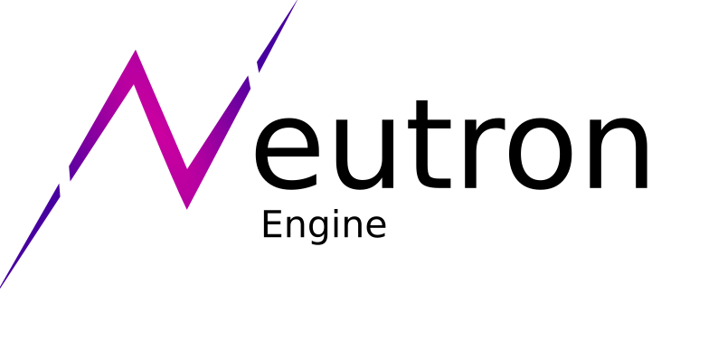

<picture>
  <source media="(prefers-color-scheme: dark)" srcset="./branding/typespace-logo-light.png">
  
</picture>

#### A libre Game Engine written in C++, with support for C# and C++ scripting (with likely more to come)

---

[Examples](./Neutxample#readme)
